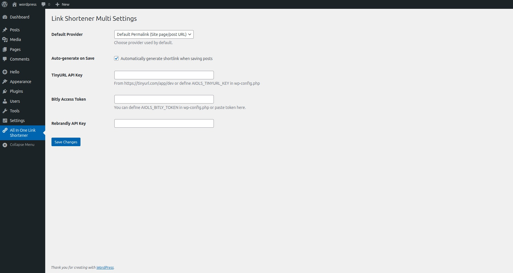
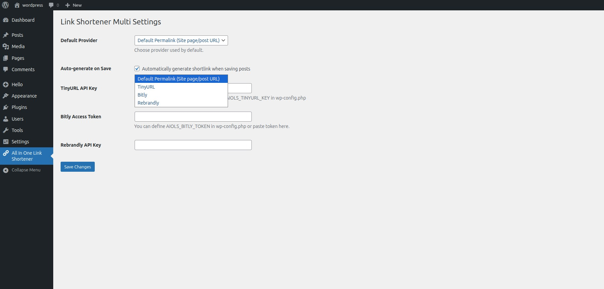
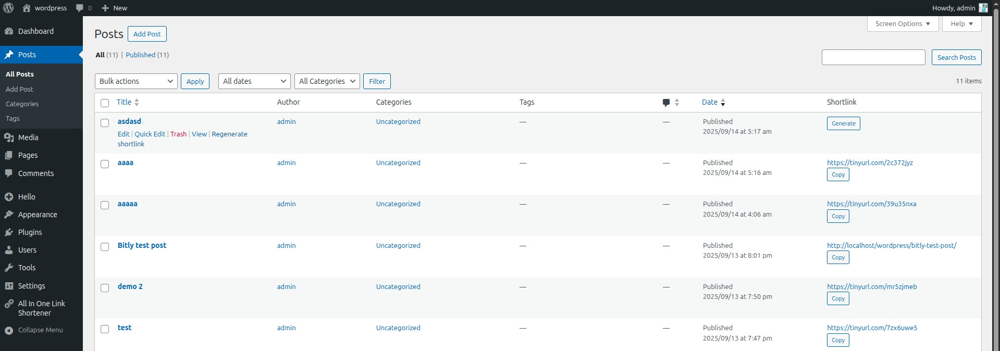
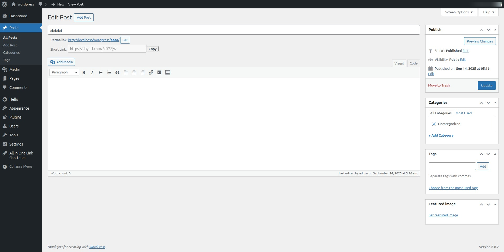
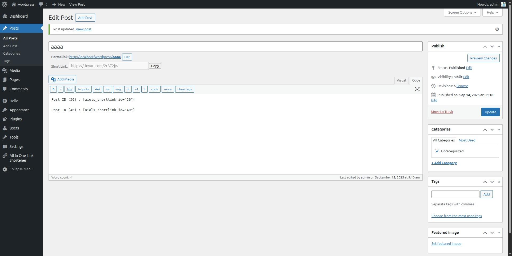
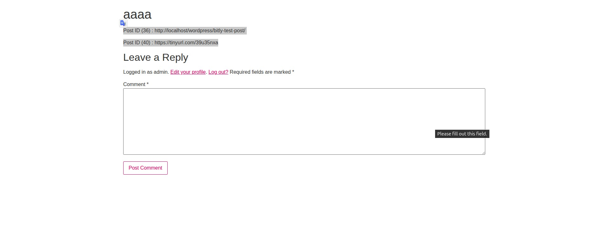

# All In One Link Shortener

---

## 📊 Repo Stats


---

**Contributors:** [shitalparmar443](https://profiles.wordpress.org/shitalparmar443/)

**Donate link:** [PayPal](https://www.paypal.me/shitalparmar443/)

**Tags:** shortlink, permalink, seo, url-shortener, links

**Requires at least:** 6.1

**Tested up to:** 6.8

**Stable tag:** 1.0.3

**Requires PHP:** 7.4

**License:** GPLv3 or later

**License URI:** [https://www.gnu.org/licenses/gpl-3.0.html](https://www.gnu.org/licenses/gpl-3.0.html)

Create shortlinks for WordPress posts/pages with **Bitly, TinyURL, Rebrandly, cutt.ly, is.gd, t.ly**, or **native permalinks**.

---

## 📚 Description

**All In One Link Shortener** allows easy generation of shortlinks for your WordPress content.
Choose from multiple providers: **Bitly, TinyURL, Rebrandly, cutt.ly, is.gd, t.ly**, or use **WordPress permalinks**.

### 🔑 Compliance with WordPress.org Guidelines

* **External Services:** Only the permalink URL of a post/page is sent to third-party APIs (Bitly, TinyURL, Rebrandly, cutt.ly, is.gd, t.ly). No personal data, titles, or analytics are transmitted.
* **Privacy:** The plugin does **not** track users, collect analytics, or include hidden data collection. Shortlinks are generated only when publishing or updating a post.

### ✨ Features

* Automatic shortlink generation on publish/update.
* Supports providers: Bitly, TinyURL, Rebrandly, or WordPress permalinks.
* Admin column with copy-to-clipboard button.
* Regenerate shortlinks via post actions or bulk actions.
* WP-CLI support for developers.
* Shortcode `[aiols_shortlink id="123"]`.
* Secure API token setup in plugin settings.

---

## 🔓 How to Generate API Tokens

### Bitly (Generic Access Token)

1. Sign in at [Bitly](https://bitly.com).
2. Navigate to **Settings → API / Developer**.
3. Generate a **Generic Access Token**.
4. Copy and paste into **All In One Link Shortener**.

### TinyURL (API Key)

1. Sign up/sign in at [TinyURL](https://tinyurl.com/app/dev).
2. Open **Developer / API Settings**.
3. Create an **API Key**.
4. Paste into plugin settings.

### Rebrandly (API Key)

1. Sign in at [Rebrandly Dashboard](https://app.rebrandly.com/).
2. Go to **Developer → API Keys**.
3. Generate a new API key.
4. Paste it into plugin settings.

### Cutt.ly (API Key)
1. Sign in at [Cutt.ly](https://cutt.ly/).
2. In the left sidebar, go to API → [API Key](https://cutt.ly/edit).
3. Your API Key will be visible on the right side under your account information.
4. If you don’t have one, click Generate API Key to create a new key.
5. Copy the generated key and store it securely.
6. Paste it into your plugin settings → Save Changes.

### is.gd (No API Key Required)
1. Visit [is.gd](https://is.gd/developers.php)
2. You don’t need to create an account or API key — is.gd’s shortening service is open for public use.
3. To shorten a link using the API, simply use the following URL format: `https://is.gd/create.php?format=json&url=YOUR_LONG_URL`.
4. Replace YOUR_LONG_URL with the actual link you want to shorten.
5. You can test this directly in your browser or use it programmatically via your plugin.
6. For full API documentation, visit [is.gd API Reference](https://is.gd/developers.php).

### T.LY (API Key Required)
1. Visit [T.LY](https://t.ly/) and create a free account.
2. Generate your API key from your [T.LY Dashboard](https://t.ly/links).
3. To shorten a link using the API, send a POST request to `https://api.t.ly/api/v1/link/shorten` with your long URL and API token.
4. The API will return a JSON response containing short_url. Use this value as the shortened link.
5. For full API documentation, visit [T.LY API Docs](https://t.ly/docs).

### Add Token to Plugin

1. Go to **WordPress Admin → All In One Link Shortener**.
2. Select your provider and paste the token.
3. Save changes and publish a post to verify shortlink generation.

---

## 🛡️ Security Best Practices

1. Treat tokens as secrets — do not commit to Git or expose publicly.
2. Store tokens only in plugin settings (WordPress Options).
3. Limit token permissions if supported.
4. Rotate/revoke tokens if compromised.
5. Include links to each provider's privacy and terms pages.

---

## ⚙️ Installation

1. Upload the plugin to `/wp-content/plugins/all-in-one-link-shortener`.
2. Activate it from the **Plugins** menu.
3. Open **All In One Link Shortener** settings.
4. Choose default provider and enter API token if needed.
5. Publish/update a post to generate a shortlink.

---

## ❓ Frequently Asked Questions

**Which providers are supported?**

* WordPress Permalinks (no external API)
* Bitly → [API Docs](https://dev.bitly.com/)
* TinyURL → [API Docs](https://tinyurl.com/app/dev)
* Rebrandly → [API Docs](https://developers.rebrandly.com/)
* Cutt.ly → [API Docs](https://cutt.ly/api-documentation/regular-api)
* is.gd → [API Docs](https://is.gd/developers.php)
* T.LY → [API Docs](https://t.ly/docs)

**Do I need an API token?**
Yes, Bitly, TinyURL, Rebrandly, cutt.ly, t.ly are supported. API keys are required. WordPress permalinks and is.gd do not require keys.

**What data is sent?**
Only the permalink URL. No personal data is shared.

**Where are shortlinks stored?**
Shortlinks are stored as post meta (`_aiols_shortlink`).

**Can I use this plugin without third-party services?**
Yes, select **Permalink** as the provider.

---

## 🖼️ Screenshots

1. Copy shortlink button in the post editor.


2. Shortlink column in post list.


3. Settings page with provider + token options.

4. Shortcode display in frontend.


---

## 🌐 External Services

1. **Bitly**

   * API URL: [https://dev.bitly.com/api-reference/](https://dev.bitly.com/api-reference/)
   * Purpose: Generate shortlinks using Bitly.
   * Data Sent: Original URL + API token.
   * Terms: [Bitly TOS](https://bitly.com/pages/terms-of-service)
   * Privacy: [Bitly Privacy](https://bitly.com/pages/privacy)

2. **TinyURL**

   * API URL: [https://tinyurl.com/app/dev](https://tinyurl.com/app/dev)
   * Purpose: Generate shortlinks using TinyURL.
   * Data Sent: Original URL + API key.
   * Terms: [TinyURL TOS](https://tinyurl.com/app/terms)
   * Privacy: [TinyURL Privacy](https://tinyurl.com/app/privacy-policy)

3. **Rebrandly**

   * API URL: [https://developers.rebrandly.com/reference/createlink](https://developers.rebrandly.com/reference/createlink)
   * Purpose: Generate shortlinks using Rebrandly.
   * Data Sent: Original URL + API key.
   * Docs: [Rebrandly Docs](https://developers.rebrandly.com/docs/get-started)
   * Terms: [Rebrandly TOS](https://www.rebrandly.com/terms)
   * Privacy: [Rebrandly Privacy](https://www.rebrandly.com/privacy)

4. **cutt.ly**  
   - API URL: [https://cutt.ly/api-documentation/regular-api](https://cutt.ly/api-documentation/regular-api)
   - Purpose: Generate short links using cutt.ly.  
   - Data Sent: Original URL + API key.  
   - Documentation: [https://cutt.ly/api-documentation/regular-api](https://cutt.ly/api-documentation/regular-api)
   - Terms of Service: [cutt.ly TOS](https://cutt.ly/terms)
   - Privacy Policy: [cutt.ly Privacy](https://cutt.ly/privacy)
   - Contact us : [cutt.ly Contact us](https://cutt.ly/contact)

5. **is.gd API Information (No API Key Required)**
	- API URL: [https://is.gd/create.php?format=json&url=YOUR_LONG_URL](https://is.gd/create.php?format=json&url=YOUR_LONG_URL)  
	- Purpose: Generate short links without requiring an API key.  
	- Data Sent: Original long URL (no authentication required).  
	- Documentation: [https://is.gd/developers.php](https://is.gd/developers.php)  
	- Terms of Service: [https://is.gd/terms.php](https://is.gd/terms.php)  
	- Privacy Policy: [https://is.gd/privacy.php](https://is.gd/privacy.php)  
	- Contact Us: [https://is.gd/contact.php](https://is.gd/contact.php)

6. **T.LY API Information (API Key Required)**
	- API URL: [https://t.ly/docs)  
	- Purpose: Generate short links without requiring an API key.  
	- Data Sent: Original long URL (no authentication required).  
	- Documentation: [https://t.ly/docs](https://t.ly/docs)  
	- Terms of Service: [https://t.ly/terms](https://t.ly/terms)  
	- Privacy Policy: [https://t.ly/privacy](https://t.ly/privacy)  
	- Contact Us: [https://t.ly/contact](https://t.ly/contact)

---

## 📌 Changelog

### 1.0.3
* T.LY shortlink provider added.
* provider's get_key change default `aiols_` prefix added.

### 1.0.2
* is.gd shortlink provider added.

### 1.0.1
* cutt.ly shortlink provider added.

### 1.0

* Initial release
* Multi-provider support (Bitly, TinyURL, Rebrandly)
* Default WordPress Permalink provider
* Bulk regenerate + WP-CLI support
* Shortcode `[aiols_shortlink id="123"]`
* Proper enqueue of JS and CSS using `wp_enqueue_script()` and `wp_enqueue_style()`

---

## 🔔 Upgrade Notice

### 1.0

First release. Token-based providers supported. Only permalinks are sent to third-party APIs.

---

## 🌱 Open Source

* GitHub: [All In One Link Shortener](https://github.com/shitalparmar443/all-in-one-link-shortener)
* Contributions via pull requests are welcome.

---

## 💬 Support

* Use the [WordPress.org support forum](https://wordpress.org/support/plugin/all-in-one-link-shortener/) or open an issue on GitHub.

---

### Shortcode Example

```php
[aiols_shortlink id="123"]
```
